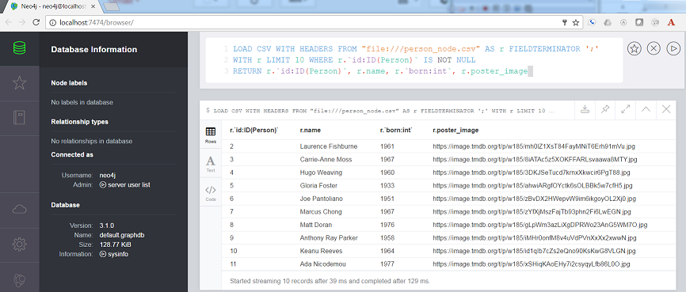
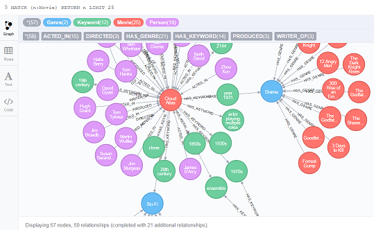
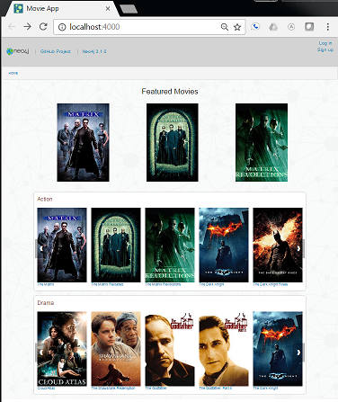
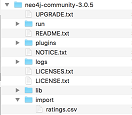

# README

This Neo4j-based node / react web app displays movie and person data in a manner similar to IMDB.  It is designed to serve as a template for further development projects.  Feel encouraged to fork and update this repo!

## The Model


### Nodes

* `Movie`
* `Person`
* `Genre`
* `Keyword`

### Relationships

* `(:Person)-[:ACTED_IN {role:"some role"}]->(:Movie)`
* `(:Person)-[:DIRECTED]->(:Movie)`
* `(:Person)-[:WRITER_OF]->(:Movie)`
* `(:Person)-[:PRODUCED]->(:Movie)`
* `(:MOVIE)-[:HAS_GENRE]->(:Genre)`

## Database Setup

### Unix _[Video Instructions](https://youtu.be/O71B2KcTD6A)_

* [Download Neo4j Community Edition: .tar Version](https://neo4j.com/download/other-releases/)
* [video instructions start here](https://youtu.be/O71B2KcTD6A)
* Set your `NEO4J_HOME` variable: `export NEO4J_HOME=/path/to/neo4j-community`
* From this project's root directory, run the import script:

```
$NEO4J_HOME/bin/neo4j-import --into $NEO4J_HOME/data/databases/graph.db --nodes:Person csv/person_node.csv --nodes:Movie csv/movie_node.csv --nodes:Genre csv/genre_node.csv --nodes:Keyword csv/keyword_node.csv --relationships:ACTED_IN csv/acted_in_rels.csv --relationships:DIRECTED csv/directed_rels.csv --relationships:HAS_GENRE csv/has_genre_rels.csv --relationships:HAS_KEYWORD csv/has_keyword_rels.csv --relationships:PRODUCED csv/produced_rels.csv --relationships:WRITER_OF csv/writer_of_rels.csv --delimiter ";" --array-delimiter "|" --id-type INTEGER
```

If you see `Input error: Directory 'neo4j-community-3.0.3/data/databases/graph.db' already contains a database`, delete the `graph.db` directory and try again.

* Add [constraints](https://neo4j.com/docs/developer-manual/current/cypher/#query-constraints) to your database: `$NEO4J_HOME/bin/neo4j-shell < setup.cql -path $NEO4J_HOME/databases/graph.db`
* Start the database: `$NEO4J_HOME/bin/neo4j start`


### Windows

[Download Neo4j Community Edition](https://neo4j.com/download/)

`neo4j-import` does not come with Neo4j-Desktop (`.exe` on Windows, `.dmg` on OSX).
To get around this issue (especially for this small database) you can enter the cypther commands in the Neo4j [browser](http://localhost:7474/browser/).
The commands are provided in the [setupCypherCommands.txt](./setupCypherCommands.txt) file.

* Use the GUI to select and start your database.
* Run a test script to make sure everything is working:
```
// test
LOAD CSV WITH HEADERS FROM "file:///person_node.csv" AS r FIELDTERMINATOR ';'
WITH r LIMIT 10 WHERE r.`id:ID(Person)` IS NOT NULL
RETURN r.`id:ID(Person)`, r.name, r.`born:int`, r.poster_image
```
The most common error at this point is in finding the csv files.
A simple solution is to copy the csv files into the default `/import` location noted in the error message.
If everything runs corretly you should get the following:

  

* continue running each of the scripts (each deliniated by a semicolon) found in [setupCypherCommands.txt](./setupCypherCommands.txt).  You can verify everything loaded correctly form the neo4j browser by clicking on the Node labels | Movie and then double clicking one of the movies (like Cloud Atlas illustrated below)

  

### Start the Database!

* Start Neo4j if you haven't already!
* Set your username and password (You'll run into less trouble if you don't use the defaults)
* Set environment variables (Note, the following is for Unix, for Windows you will be using `set=...`)
  * Export your neo4j database username `export MOVIE_DATABASE_USERNAME=myusername`
  * Export your neo4j database password `export MOVIE_DATABASE_PASSWORD=mypassword`
* You should see a database populated with `Movie`, `Genre`, `Keyword`, and `Person` nodes.

## Node API

From the root directory of this project:

* `cd api`
* `npm install`
* `node app.js` starts the API
* Take a look at the docs at [http://localhost:3000/docs](http://localhost:3000/docs)

## Alternative: Flask API

From the root directory of this project:

* `cd flask-api`
* `pip install -r requirements.txt` (you should be using a [virtualenv](http://docs.python-guide.org/en/latest/dev/virtualenvs/))
* set environment variables (Note, the following is for Unix, for Windows you will be using `set=...`)
  * `export FLASK_APP=app.py`
* `flask run` starts the API
* Take a look at the docs at [http://localhost:5000/docs](http://localhost:5000/docs)

## Frontend

This step may present some problems on Windows becasue it requries both Bower and gulp to be installed.  A common problem with these npm installations is the path is not properly set to the script files are not found.
A simple fix for this is to manually set the `PATH` (in my case I also use nvm to manage node versions so the set script looks like the following):


From the root directory of this project, set up and start the frontend with:

* `cd web`
* `npm install` (if `package.json` changed)
* `bower install` to install the styles
* update config.settings.js file
  * if you are using the Node API: `copy config/settings.example.js config/settings.js`
  * if you are using the flask api then edit `config/settings.js` and change the `apiBaseURL` to `http://localhost:5000/api/v0`
* `gulp` starts the app on [http://localhost:4000/](http://localhost:4000/)

  

  voilà! Netflix, eat your heart out ;-)

## Ratings and Recommendations

### Load some fake users and ratings

If you're running the app locally, you might want to tweak or explore ratings without having a robust community of users.
In the `/csv` directory, note that there is a file called `ratings.csv`.
This file contains some pseudo-randomly generated users and ratings.
Load the users and ratings:

Move `ratings.csv` into the `import` directory of your database either by dragging and dropping or using

```
cp csv/ratings.csv $NEO4J_HOME/import/ratings.csv
```



Assuming your database is running, paste the following query into the Neo4j browser:

```
LOAD CSV WITH HEADERS FROM 'file:///ratings.csv' AS line
MATCH (m:Movie {id:toInt(line.movie_id)})
MERGE (u:User {id:line.user_id, username:line.user_username}) // user ids are strings
MERGE (u)-[r:RATED]->(m)
SET r.rating = toInt(line.rating)
RETURN m.title, r.rating, u.username
```

If you don't want to use the browser, you can uncomment out the above query in `setup.cql` and run it again using `$NEO4J_HOME/bin/neo4j-shell < setup.cql`

### User-Centric, User-Based Recommendations

Based on my similarity to other users, user `Sherman` might be interested in movies rated highly by users with similar ratings as himself.

```
MATCH (me:User {username:'Sherman'})-[my:RATED]->(m:Movie)
MATCH (other:User)-[their:RATED]->(m)
WHERE me <> other
AND abs(my.rating - their.rating) < 2
WITH other,m
MATCH (other)-[otherRating:RATED]->(movie:Movie)
WHERE movie <> m
WITH avg(otherRating.rating) AS avgRating, movie
RETURN movie
ORDER BY avgRating desc
LIMIT 25
```

### Movie-Centric, Keyword-Based Recommendations

Site visitors interested in movies like `Elysium` will likely be interested in movies with similar keywords.

```
MATCH (m:Movie {title:'Elysium'})
MATCH (m)-[:HAS_KEYWORD]->(k:Keyword)
MATCH (movie:Movie)-[r:HAS_KEYWORD]->(k)
WHERE m <> movie
WITH movie, count(DISTINCT r) AS commonKeywords
RETURN movie
ORDER BY commonKeywords DESC
LIMIT 25
```

### User-Centric, Keyword-Based Recommendations

`Sherman` has seen many movies, and is looking for movies similar to the ones he has already watched.

```
MATCH (u:User {username:'Sherman'})-[:RATED]->(m:Movie)
MATCH (m)-[:HAS_KEYWORD]->(k:Keyword)
MATCH (movie:Movie)-[r:HAS_KEYWORD]->(k)
WHERE m <> movie
WITH movie, count(DISTINCT r) AS commonKeywords
RETURN movie
ORDER BY commonKeywords DESC
LIMIT 25
```

## Contributing

### Node.js/Express API

The Express API is located in the `/api` folder.

#### Create Endpoint

The API itself is created using the [Express web framework for Node.js](https://expressjs.com/). The API endpoints
are documented using swagger and [swagger-jsdoc](https://www.npmjs.com/package/swagger-jsdoc) module.

To add a new API endpoint there are 3 steps:

1. Create a new route method in `/api/routes` directory
2. Describe the method with swagger specification inside a JSDoc comment to make it visible in swagger
3. Add the new route method to the list of route methods in `/api/app.js`.

### Flask API

The flask API is located in the flask-api folder.  The application code is in the `app.py` file.

#### Create Endpoint

The API itself is created using the [Flask-RESTful](http://flask-restful-cn.readthedocs.io/en/0.3.5/) library.  The API endpoints
are documented using swagger with the [flask-restful-swagger-2](https://github.com/swege/flask-restful-swagger-2.0) library.

To add a new API endpoint there are 3 steps:

1. Create a new Flask-RESTful resource class
2. Create an endpoint method including the swagger docs decorator.
3. Add the new resource to the API at the bottom of the file.
